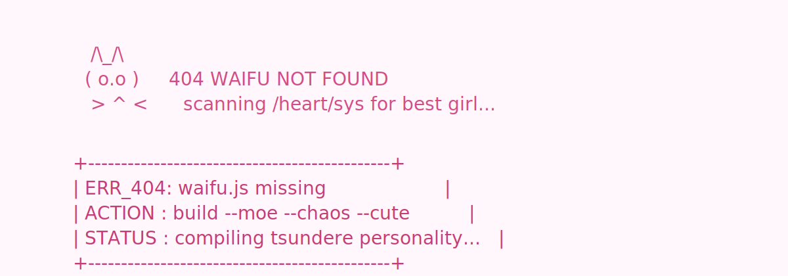

Welcome to the **404 Waifu Not Found** GitHub Organization — a place where **anime culture meets coding chaos**. We build fun, experimental, and occasionally cursed projects inspired by **otaku culture, memes, and technology**.
---

## ✨ About

**404 Waifu Not Found** is a developer collective focused on:

* 🎌 Anime-inspired software projects
* 🤖 AI + anime experiments
* 🧠 Hackathon builds
* 💻 Fun developer tools
* 🎮 Games, bots, and creative coding

This organization was created for developers who enjoy **coding, anime, memes, and building weird but cool things**.

---

## 🛠 Tech Stack

Our projects may use a mix of technologies including:

* Python
* JavaScript / TypeScript
* React / Next.js
* Node.js
* Docker
* AI / Machine Learning tools
* APIs and bots

We like experimenting with **new tools, frameworks, and ideas**.

---

## 📜 Code Philosophy

> “Code is temporary. Waifu is eternal.”

We value:

* Creativity
* Humor
* Learning
* Collaboration
* Shipping cool things

---

## 💬 Community

If you enjoy:

* Anime
* Programming
* Memes
* Hackathons
* AI experiments

Then you're in the right place.

---
## ⚠️ Disclaimer

This organization is primarily for **fun, experimentation, and learning**. Expect chaotic commits, experimental ideas, and occasionally cursed code.

---

**404 Waifu Not Found**

*If the waifu doesn't exist… we'll build one.* 🌸
